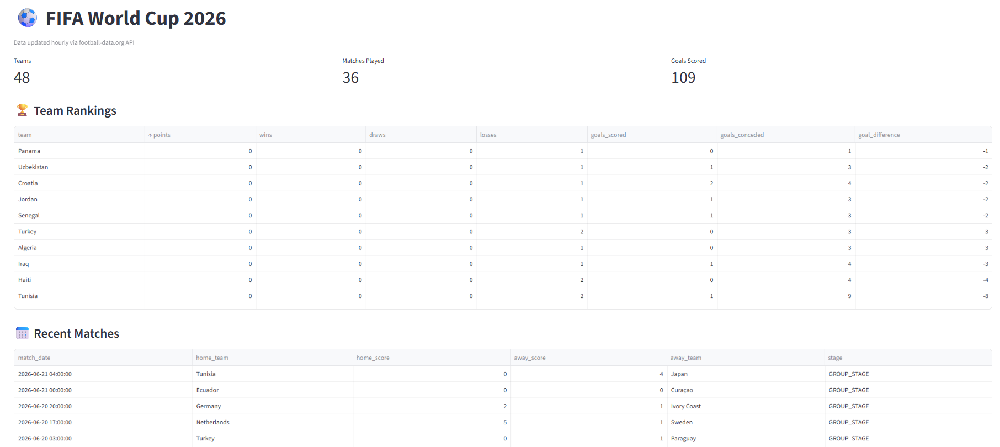

# ⚽ Copa 2026 - Data Engineering Pipeline

A real-time data pipeline for the 2026 FIFA World Cup, built with modern data engineering tools.



## 🏗️ Architecture

- **Ingestion:** Python + REST API (football-data.org)
- **Orchestration:** Apache Airflow
- **Storage:** PostgreSQL + Data Lake (raw / trusted / refined)
- **Transformation:** Pandas + dbt
- **Dashboard:** Streamlit

## 🛠️ Tech Stack

 - Ingestion: Python + REST API
 - Orchestration: Apache Airflow
 - Storage: PostgreSQL
 - Transformation: Pandas + dbt
 - Dashboard: Streamlit
 - Infrastructure: Docker + Docker Compose

## 🚀 How to run

1. Clone the repository
```bash
   git clone https://github.com/nararodriguess/copa2026-data-pipeline
   cd copa2026-data-pipeline
```
2. Create a `.env` file based on `.env.example`:
3. Create the dbt profile based on `dbt_project/profiles.yml.example`

4. Start the containers:
```bash
   docker compose up -d
```

5. Access:
   - Airflow: http://localhost:8080
   - Dashboard: http://localhost:8501

6. Trigger the `dag_get_games` DAG in Airflow

## 📊 Data Flow

- **raw** → raw JSON from the API
- **trusted** → structured data in PostgreSQL (`matches` table)
- **refined** → dbt models with rankings and statistics (`team_rankings` view)

## 📝 License
MIT